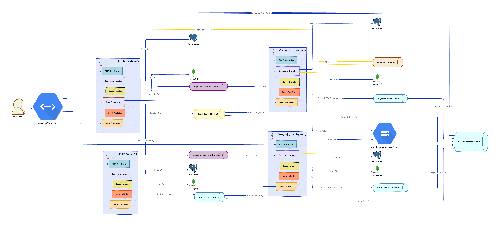

# Microservices-java

This repository showcases a microservices-based application written in Java, featuring multiple services (Order, Inventory, User, Payment) and supporting infrastructure (Kubernetes, Terraform, CI/CD, etc.).


> **Quick Start:** For an easy-to-read overview and detailed guides, please visit our documentation site at [https://doc.fadellh.com/](https://doc.fadellh.com/).

[](https://opensource.org/licenses/Apache-2.0)

---

## Table of Contents

- [Microservices-java](#microservices-java)
  - [Table of Contents](#table-of-contents)
  - [High-level Architecture](#high-level-architecture)
  - [Service Responsibilities](#service-responsibilities)
  - [Setup Local](#setup-local)
  - [Deploy to Kubernetes](#deploy-to-kubernetes)
    - [1. Build the Docker Image](#1-build-the-docker-image)
    - [2. Push the Image to a Registry](#2-push-the-image-to-a-registry)
    - [3. Deploy to GKE (Example)](#3-deploy-to-gke-example)
    - [4. Data Migration \& Load Testing](#4-data-migration--load-testing)
      - [Load Testing Results](#load-testing-results)
    - [5. Terraform Setup](#5-terraform-setup)
  - [Additional Resources](#additional-resources)
  - [License](#license)

---

## High-level Architecture

Below is the high-level architecture diagram illustrating how the services interact:



Each microservice is autonomous and communicates with others through REST or messaging (e.g., Kafka). A central API Gateway may be employed for routing external requests.

---

## Service Responsibilities

1. **[Order Service](docs/order-service.md)**  
   - Manages all order-related operations (creation, approval, cancellation, etc.).  
   - Coordinates with Inventory and Payment services.  

2. **[Inventory Service](docs/inventory-service.md)**  
   - Maintains product stock levels.  
   - Handles stock deduction, restore, and transfers between warehouses/locations.  

3. **[User Service](docs/user-service.md)**  
   - Manages both administrative and customer user data.  
   - Uses Firebase or another auth provider for authentication.  

4. **Payment Service** *(Placeholder)*  
   - Handles payment authorization, capture, and refunds.  
   - Integrates with external payment gateways.

> **Note**: Additional services may be added as needed, such as a Notification Service or Shipping Service.

---

## Setup Local

1. **Copy application-secrets.template.yml**  
   For each service, copy `application-secrets.template.yml` to a new file named `application-secrets.yml`. Update the credentials and secret values accordingly.

2. **Terraform Variables**  
   If you are using Terraform for local or remote resources, fill out the required variables in your `terraform.tfvars` (see [Terraform Project](infrastructure/terraform/gke-cluster/README.md) for more details).

3. **Build & Run**  
   - Make sure you have a running database (e.g., PostgreSQL, MySQL, or MongoDB) according to each service’s configuration.  
   - Run `mvn clean install` for a full build.  
   - Start each service (e.g., `mvn spring-boot:run`) or use Docker Compose if provided.

---

## Deploy to Kubernetes

You can deploy the services to a Kubernetes cluster via CI/CD pipelines or manually.

### 1. Build the Docker Image

From each service directory (or the project root if using a multi-module approach):

```bash
mvn clean install spring-boot:build-image
```

> This uses [Spring Boot’s Cloud Native Buildpacks](https://docs.spring.io/spring-boot/docs/current/reference/htmlsingle/#container-images) to create Docker images.

### 2. Push the Image to a Registry

```bash
docker login -u $ARTIFACTORY_USER -p $ARTIFACTORY_PASSWORD $ARTIFACTORY_URL
docker tag microservices-java $ARTIFACTORY_URL/microservices-java
docker push $ARTIFACTORY_URL/microservices-java
```

### 3. Deploy to GKE (Example)

Apply the Kubernetes manifests:

```bash
kubectl apply -f infrastructure/kubernetes/microservices-deployment.yml
```

> Adapt these commands as necessary for your environment or other deployment methods.

### 4. Data Migration & Load Testing

- **[Running Data Migration](scripts/data-migration/README.md)**  
  Use the provided Python scripts or SQL files to create and populate your schemas.
- **[Running Load Test](scripts/load-testing/README.md)**  
  Follow the instructions to perform load or stress testing against your deployed services.

#### Load Testing Results

The following load testing results are available in the repository:

- [Baseline Testing (50 CCU)](scripts/load-testing/result/baseline-testing-50-ccu.html)
- [Performance Testing (300 CCU)](scripts/load-testing/result/perfomace-ccu-300.html)
- [Performance Testing (600 CCU)](scripts/load-testing/result/perfomance-600-ccu.html)

### 5. Terraform Setup

If you are managing infrastructure on Google Cloud (or another provider), you can use Terraform to:

- Provision GKE clusters, networking, and DNS.
- Configure Kafka, firewall rules, and certificates.

See [**Terraform Project**](infrastructure/terraform/gke-cluster/README.md) for detailed steps.

---

## Additional Resources

- **Docs Folder**  
  - [Order Service Docs](docs/order-service.md)  
  - [Inventory Service Docs](docs/inventory-service.md)  
  - [User Service Docs](docs/user-service.md)  
  - [JWT Flow Diagrams](docs/jwt_flow.svg)

- **Scripts**  
  - [Data Migration](scripts/data-migration/README.md)  
  - [Load Testing](scripts/load-testing/README.md)

- **Infrastructure**  
  - [Terraform Project](infrastructure/terraform/gke-cluster/README.md)

- **Low-level Diagrams**  
  - [Low-level Inventory Diagram](docs/low-level-inventory-service.svg)  
  - [Low-level Order Diagram](docs/low-level-order-service.svg)

---

## License

Licensed under the [Apache License, Version 2.0](https://www.apache.org/licenses/LICENSE-2.0). You may obtain a copy of the License at:

```
http://www.apache.org/licenses/LICENSE-2.0
```

---  

**Happy Coding!**  
If you have any questions or encounter any issues, please open a GitHub issue or contact the maintainers.
```