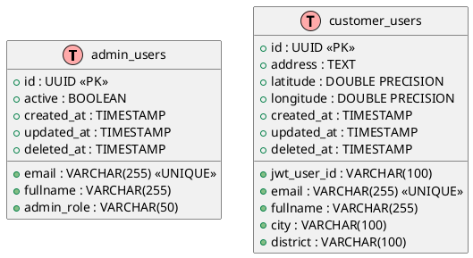

# User Service

This service is responsible for managing user data for both administrative and customer users. It provides simple RESTful APIs to create, verify, and retrieve user records. The service does not include any saga or command processing; its primary functions are to expose APIs and manage data storage.

In addition to the core API functionality and database schema, the User Service leverages Firebase for authentication and authorization. The following diagrams and explanations illustrate the authentication/authorization flow as well as the user signup flow.

---

## Table of Contents

- [User Service](#user-service)
  - [Table of Contents](#table-of-contents)
  - [APIs](#apis)
    - [RESTful Endpoints](#restful-endpoints)
  - [Authentication and Authorization Flow](#authentication-and-authorization-flow)
    - [Diagram: Authentication and Authorization Flow](#diagram-authentication-and-authorization-flow)
  - [Signup Flow](#signup-flow)
    - [Diagram: Signup Flow](#diagram-signup-flow)
  - [Database Schema](#database-schema)
    - [admin\_users Table](#admin_users-table)
    - [customer\_users Table](#customer_users-table)
  - [UML Diagram (Database Schema)](#uml-diagram-database-schema)
  - [Contributing](#contributing)
  - [License](#license)

---

## APIs

### RESTful Endpoints

> **Base URL Example:** `https://api.example.com/v1`

| **Method** | **Endpoint**           | **Request**                                  | **Response**                       | **Description**                                                                 |
|------------|------------------------|----------------------------------------------|------------------------------------|---------------------------------------------------------------------------------|
| `POST`     | `/users/verify`        | JSON: `{ "email": "..." }`                   | JSON: User details or error message | Verify a user by email.                                                         |
| `POST`     | `/users/create`        | JSON: `{ "email": "...", "fullname": "..." }` | JSON: Newly created user details   | Create a new user. If the user already exists, returns the existing record.     |
| `GET`      | `/users/{userId}`      | –                                            | JSON: User details                  | Retrieve detailed information for a specific user by their unique ID.           |

> **Note:**  
> - Authentication and authorization for these endpoints are handled via JWTs provided by Firebase.  
> - The API endpoints are designed to be lightweight since the service's primary function is user management.

---

## Authentication and Authorization Flow

The User Service relies on Firebase Authentication to handle user login and secure API access. The following diagram explains the authentication and authorization process:

### Diagram: Authentication and Authorization Flow

 

> **Explanation:**
>
> 1. **Login and JWT Generation**  
>    - The **User** enters their email and password in the frontend application (built with React).
>    - The **Frontend (React)** sends these credentials to **Firebase Authentication**.
>    - Upon successful authentication, Firebase returns a JWT (ID Token) to the frontend.
>
> 2. **API Request with JWT**  
>    - The **User** requests a protected resource from the frontend.
>    - The **Frontend (React)** attaches the JWT in the Authorization header and sends the request to the **API Gateway**.
>    - The **API Gateway** validates the JWT by consulting Firebase’s JWKS URI.
>    - Once validated, the API Gateway forwards the request along with the JWT claims to the **Backend (User Service)**.
>
> 3. **Backend Processing**  
>    - The **User Service** processes the request, potentially fetching user data from the **User Database**.
>    - The response is then sent back through the API Gateway to the frontend, which displays the requested data to the user.

---

## Signup Flow

The signup process is similarly secured and leverages Firebase for account creation and JWT issuance. The following diagram details the signup flow:

### Diagram: Signup Flow

 

> **Explanation:**
>
> 1. **User Signup**  
>    - The **User** enters their email, password, and other required details in the frontend application.
>    - The **Frontend (React)** sends these details to **Firebase Authentication** to create a new account.
>    - Firebase returns a JWT (ID Token) upon successful account creation.
>
> 2. **Send Additional User Data to Backend**  
>    - The **Frontend (React)** sends the JWT along with additional user information (e.g., name, phone, etc.) to the **API Gateway**.
>    - The **API Gateway** validates the JWT by consulting Firebase’s JWKS URI.
>    - The validated request, along with the JWT claims and additional user data, is forwarded to the **Backend (User Service)**.
>    - The **User Service** stores the user data in the **User Database**.
>    - A success response is returned through the API Gateway and displayed to the user by the frontend.

---

## Database Schema

The User Service manages two types of users: administrative users and customer users. The data is stored in two separate tables.

### admin_users Table

| **Column**    | **Type**           | **Properties**         | **Description**                         |
|---------------|--------------------|------------------------|-----------------------------------------|
| `id`          | UUID               | Primary Key            | Unique identifier for the admin user.   |
| `email`       | VARCHAR(255)       | UNIQUE                 | Email address of the admin user.        |
| `fullname`    | VARCHAR(255)       |                        | Full name of the admin user.            |
| `admin_role`  | VARCHAR(50)        |                        | Role assigned to the admin user.        |
| `active`      | BOOLEAN            |                        | Indicates whether the account is active.|
| `created_at`  | TIMESTAMP          |                        | Record creation timestamp.              |
| `updated_at`  | TIMESTAMP          |                        | Last update timestamp.                  |
| `deleted_at`  | TIMESTAMP          |                        | Timestamp for soft deletion, if applicable. |

### customer_users Table

| **Column**      | **Type**              | **Properties**         | **Description**                           |
|-----------------|-----------------------|------------------------|-------------------------------------------|
| `id`            | UUID                  | Primary Key            | Unique identifier for the customer user.  |
| `jwt_user_id`   | VARCHAR(100)          |                        | Identifier from JWT (if applicable).      |
| `email`         | VARCHAR(255)          | UNIQUE                 | Email address of the customer.            |
| `fullname`      | VARCHAR(255)          |                        | Full name of the customer.                |
| `address`       | TEXT                  |                        | Residential or delivery address.          |
| `city`          | VARCHAR(100)          |                        | City portion of the address.              |
| `district`      | VARCHAR(100)          |                        | District/region of the address.           |
| `latitude`      | DOUBLE PRECISION      |                        | Geographical latitude coordinate.         |
| `longitude`     | DOUBLE PRECISION      |                        | Geographical longitude coordinate.        |
| `created_at`    | TIMESTAMP             |                        | Record creation timestamp.                |
| `updated_at`    | TIMESTAMP             |                        | Last update timestamp.                    |
| `deleted_at`    | TIMESTAMP             |                        | Timestamp for soft deletion, if applicable.|

---

## UML Diagram (Database Schema)

Below is the PlantUML snippet representing the database schema for the User Service:

> **Note:** The above UML diagram is rendered into images for clarity. You can generate and update the images using any PlantUML rendering tool if needed.

---

## Contributing

1. **Fork** the repository.
2. **Create** your feature branch (`git checkout -b feature/YourFeature`).
3. **Commit** your changes (`git commit -m 'Add some feature'`).
4. **Push** to the branch (`git push origin feature/YourFeature`).
5. **Open** a pull request for review.

---

## License

Distributed under the MIT License. See the [LICENSE](LICENSE) file for details.

---

Thank you for using the User Service!  
If you have any questions or encounter issues, please open a GitHub issue or contact the maintainers.